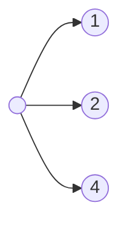
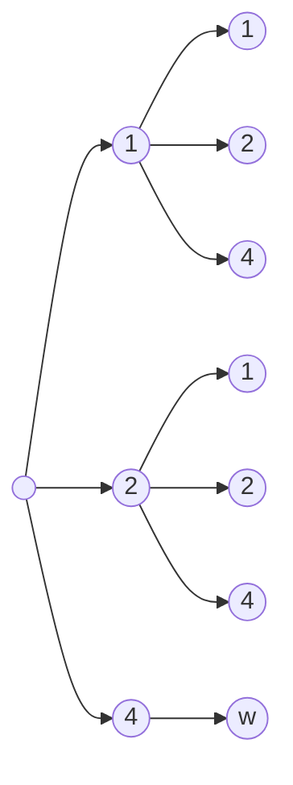
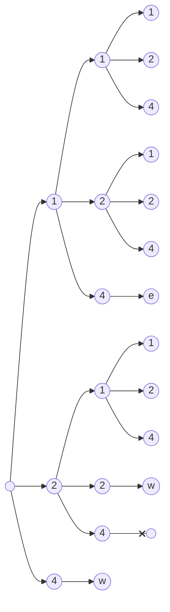
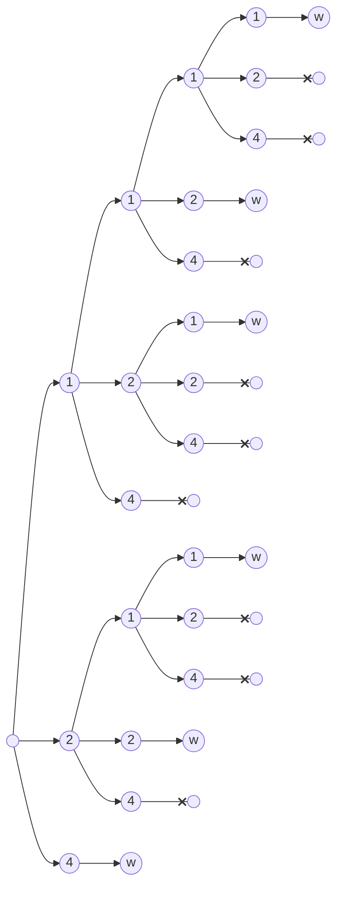
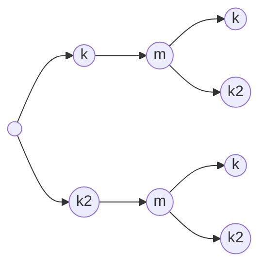

# Aufgabe 1: Choreograph

Team-ID: ???

Team-Name: ???

Bearbeiter/-innen dieser Aufgabe: ???

16. November 2025

## Inhaltsverzeichnis

1. [Lösungsidee](#Lösungsidee)
2. [Umsetzung](#Umsetzung)
3. [Werkzeuge](#Werkzeuge)
4. [Beispiele](#Beispiele)
5. [Quellcode](#Quellcode)

## Lösungsidee

Um zu bestimmen, was die beste Choreographie in einem bestimmten
Kriterium ist, müssen wir wissen, dass sie in diesem Kriterium
besser ist als alle anderen Choreographien. Wenn wir eine Liste
aller Choreographien haben und diese nach einem bestimmten
Kriterium sortieren, ist das erste Element immer die (oder
zumindest eine) beste Lösung.

Eine gütlige Choreographie hat zwei Kriterien:

1. Die Länge der Choreographie (= die Summe der Länge aller
   Figuren in einer Choreographie) muss der Länge des Stückes
   entsprechen.
2. Nachdem die Tänzer die Folge der Figuren getanzt haben, muss
   ihre Anordnung wieder der ursprünglichen Anordnung entsprechen.

Um eine Liste mit allen möglichen Choreographien zu erhalten,
könnten wir alle Kombinationen von Figuren ausprobieren und
schauen, ob sie die beiden Kriterien erfüllt -- ähnlich wie man
ein Zahlenschloss lösen kann -- und jedes mal überprüfen ob es
sich um eine passende Choreographie handelt. Allerdings ist es
schwer zu sagen, wie viele Kombinationen es gibt und damit wann
unser Programm aufhören kann, Kombinationen auszuprobieren. Denn
die Anzahl der Figuren in einer Choreographie variiert aufgrund
von unterschiedlichen Längen der Tanzfiguren.

### Kombinationen aus Längen

Wenn wir eine Tabelle erstellen, in der wir unsere Figuren nach
deren Länge sortieren, wissen wir, welche unterschiedlichen Längen
uns zur verfügung stehen. Damit könnten wir zuerst alle
Kombinationen von Längen ermitteln, die in unser Stück passen.
Also alle Kombinationen, deren Summe gleich der Länge des Stückes
entspricht.

Auch hier ist es schwer zu sagen, wie viele Kombinationen es geben
wird, weil natürlich auch hier die Zahl der aneinandergereihten
Längen variiert. Allerdings müssen wir nicht unbedingt wissen, wie
viele Kombinationen es geben wird, wenn wir einen rekursiven
Algorythmus nutzen.

Hier ist ein solcher Algorythmus. Lass uns als Beispiel folgende
Figuren nehmen:

```text
Kurz 1
Kurz2 1
Mittel 2
Lang 4
```

| 1 Takt | 2 Takte | 4 Takte |
| ------ | ------- | ------- |
| Kurz   | Mittel  | Lang    |
| Kurz2  | ---     | ---     |

Im ersten Schritt schaut sich unser Algorythmus an, welche Längen
ihm zur verfügung stehen. (1, 2 und 4 in unserem Fall)

Für jeden dieser Längen ruft er sich selbst erneut auf.



Diese Iterationen haben nun aber Daten. Nämlich jeweils 1, 2
und 4. Sie schauen zuert, ob die Summe ihrer Daten kleiner als die
Länge unseres Stückes ist (das ist der Fall für "1" und "2" aber
nicht für "4"). Und rufen sich dann erneut für alle Längen auf
übergeben aber ihre bereits gesammelten Längen.

Wenn die Summe der Längen gleich der Länge des Stückes ist, haben
wir eine mögliche Kombination aus Längen gefunden! Unser
Algorythmus soll diese dann in eine Liste eintragen.

Wenn die Summe der Längen größer als die Länge des Stückes ist,
soll der Algorythmus einfach da enden.

So sieht unser Algorythmus in der zweiten Iteration aus:



Und so in der Iteration darauf:



Das hier ist der Algorythmus in der letzten Iteration. Jeder
Strang endet mit entweder einem Abbruch oder damit, dass die Folge
aufgeschrieben wird.



Am Ende haben wir eine Liste mit allen möglichen Kombianationen
von Längen, die wie folgt aussieht:

```python
[[4], [2, 2], [2, 1, 1], [1, 2, 1], [1, 1, 2], [1, 1, 1, 1]]
```

### Kombinationen aus Figuren

Da wir die Tanzfiguren nach deren Länge sortiert haben, können wir
nun mithilfe dieser Liste alle Kombinationen von Tanzfiguren
durchgehen, die zumindest die richtige Länge haben und dann
schauen, ob am Ende auch die Tänzer in der richtigen Reihenfolge
stehen.

Wir werden wieder eine ähnliche rekursive Funktion verwenden, um
alle Kombinationen von Figuren für eine Kombination aus Längen
auszuprobieren. Dabei rufen wir die Funktion für jede mögliche
Kombination aus Längen aus. Diese geht dann die Liste von Längen
durch und ruft sich selbst mit jeder verfügbaren Figur von einer
Länge auf.

Sagen wir, wir haben die folgenden Figuren:

| 1 Takt | 2 Takte | 4 Takte |
| ------ | ------- | ------- |
| Kurz   | Mittel  | Lang    |
| Kurz2  |         |         |

Mit unserer neuen Funktion wollen wir als Beispiel die Kombination
`[1, 2, 1]` durchgehen.



An einem Endpunkt, wird überprüft, ob die Tänzer sich nach der
Folge von Figuren so bewegen, dass sie am Ende wieder so wie am
Anfang stehen (wie das ermittelt wird klären wir
[gleich](<#wurde richtig getanzt?>)). Ist das der Fall, wird eine
Choreographie mit dieser Folge zur Liste passender Choreographien
hinzufügt.

Um alle Kombinationen von Figuren zu erhalten, muss diese Funktion
mit allen möglichen Kombinationen aus Längen, die wir im
[vorherigen Schritt](<#Kombinationen aus Längen>) ermittelt haben,
aufgerufen werden.

### Wurde richtig getanzt?

Um zu überprüfen, ob nach einer Folge von Figuren alle Tänzer
wieder in der richtigne Reihenfolge stehen, muss das Programm
durch die Figuren gehen und für jede Figur die Reihenfolge
verändern.

Die Notation der Tanzfiguren enthält die Positionen der Tänzer
nach _Anwendung_ der Figur. Daran können wir erkennen, von welcher
Position welche Position kommt.

Eine Tanzfigur könnte folgende Endpositionen haben (ich werde im
Folgenden nur 8 statt 16 Zeichen/Tänzern verwenden) damit das
Ganze nicht unnötig komplex wird.

```text
Cast Four:
DABCHEFG
```

Wenn wir wissen, das die Figuren vorher in der Reihenfolge

```text
Original Reihenfolge:
ABCDEFGH
```

standen, können wir uns für jede Stelle in unserer neuen
Reihenfolge anschauen, wo ihre alte Position war. Ich bennene die
erste Position mit 0, die zweite mit 1 usw.

```python
[3, 0, 1, 2, 7, 6, 5, 4]
```

Wenn wir wissen, dass die neue erste Position immer von der
vierten Postion kommt und die neue zweite immer von der ersten
usw. können wir auch die Reihenfolge der Tänzer nach zwei dieser
Figuren bestimmen.

```
Cast Four und nochmal Cast Four:
CDABGHEF
```

Jetzt wo wir wissen, wie sich unsere Tänzer nach jeder Tanzfiguren
bewegen, können wir am Ende die Reihenfolge der Tänzer mit der
original Reihenfolge vergleichen und wissen somit, ob die Folge
von Figuren gültig ist oder nicht.

### Was ist die beste Choreo?

Jetzt wo wir die volle Liste von passenden Choreographien haben,
können wir sie nach verschiedenen Kriterien sortieren und uns das
jeweils erste Element anschauen um die (oder zumindest _eine_)
beste Choreographie in dieser Kategorie zu finden. Diese wird dann
jeweils in unser Output-File geschrieben.

> [!note]
>
> Es gibt eine Kategorie, die ohne Weiteres nicht einfach ablesbar
> ist. Dabei handelt es sich um die zurückgelegte Strecke. Deshalb
> müssen wir schon beim Überprüfen der Figuren jeweils die Zahl
> der Schritte zählen und mit der Choreographie in die Liste
> eintragen.

## Umsetzung

### Einlesung der Daten

Die Daten in den zur verfügung stehenden Dateien sind wie folgt
angeordnet:

1. Die erste Zeile enthält die Länge des Stückes (in Takten)
2. Die zweite Zahl enthält die Anzahl der unterschiedlichen
   Figuren, die zur verfügung stehen.
3. Die folgenen Zeilen enthalten die Figuren, die zur verfügung
   stehen.

Wir spalten die Input-Datei nach Zeilen auf und lesen sie dann
Zeile für Zeile ein. Um die Zahl der Takte zu erhalten, müssen wir
in Python von einem Variablentyp String (`str`) in einen Integer
(`int`) umwandeln. Das ist zum Glück einfach mit Pythons `int()`
methode.

Die zweite Zeile macht das lesen der Figuren sehr einfach, denn
sie gibt schon an, wie viele Figuren folgen werden. D.h. wir
können mithilfe einer `for`-Schleife den Rest der Figuren
einlesen, ohne dabei überprüfen zu müssen, ob wir das Ende der
Datei erreicht haben.

Beim Einlesen der Figuren splitten wir jede Zeile noch einmal nach
Leerzeichen auf, um eine Liste vom

- Namen der Figur
- der Länge der Figure
- der Reihenfolge der Tänzer nach dem Tanzen der Figur

erhalten.

Für unsere Figuren erstellen wir einen neuen Datentypen, der den
Namen und eine Liste der _Änderung der Positionen_ enthält.

```python
class Figure:
    def __init__(self, name: str, new_line_up: str):
        self.name = name

        # Maps each position to the next position
        movement: list[int] = []
        for char in new_line_up:
            movement.append("ABCDEFGHIJKLMNOP".find(char))
        self.movement = tuple(movement)
```

Anstatt die Länge der Figur in der Figur zu speichern, erstellen
wir ein Dictionary (`dict`) in dem die Figuren nach deren Länge
sortiert werden. Warum wir das tun erklärt sich gleich.

```text
Cast_Four 2
Cast_Up 4
...
```

wird zu:

```python
{
    2: [Cast_Four, ...]
    4: [Cast_Up, ...]
}
```

### Sortieren in Python

Pythons `sort()` methode macht das Sortieren unserer langen Liste
von Choreographien nach nach den verschiedenen Kriterien einfach.

## Werkzeuge

- Editor: Neovim
  [oder genauer meine Konfiguration :3](https://github.com/innin-jam/inninvim)

> [!note]
>
> Es wurde keine Art von generativer KI für die Erstellung des
> Programmiercodes verwendet

## Beispiele

### choreo01

Input-File:

```text
32
2
Cast_Four 2 DABCHEFGLIJKPMNO
Cast_Up 4 BCDEFGHIJKLMNOPA
```

Generiertes Output-File:

```markdown
# Results from ./in/choreo01.txt (13 possible choreos)

## Most Unique Dance Figures

Cast_Up, Cast_Four, Cast_Up, Cast_Four, Cast_Up, Cast_Four,
Cast_Up, Cast_Four, Cast_Four, Cast_Four, Cast_Four, Cast_Four,

## Highest Number of Dance Figures

Cast_Four, Cast_Four, Cast_Four, Cast_Four, Cast_Four, Cast_Four,
Cast_Four, Cast_Four, Cast_Four, Cast_Four, Cast_Four, Cast_Four,
Cast_Four, Cast_Four, Cast_Four, Cast_Four,

## Lowest Number of Dance Figures

Cast_Up, Cast_Four, Cast_Up, Cast_Four, Cast_Up, Cast_Four,
Cast_Up, Cast_Four, Cast_Four, Cast_Four, Cast_Four, Cast_Four,

## Most Total Movement

Cast_Four, Cast_Four, Cast_Four, Cast_Four, Cast_Four, Cast_Four,
Cast_Four, Cast_Four, Cast_Four, Cast_Four, Cast_Four, Cast_Four,
Cast_Four, Cast_Four, Cast_Four, Cast_Four,

## Least Total Movement

Cast_Up, Cast_Four, Cast_Up, Cast_Four, Cast_Up, Cast_Four,
Cast_Up, Cast_Four, Cast_Four, Cast_Four, Cast_Four, Cast_Four,
```

### choreo02

Input-File:

```text
24
4
Cycle_1 1 PABCDEFGHIJKLMNO
Cycle_2 2 OPABCDEFGHIJKLMN
Cycle_3 3 NOPABCDEFGHIJKLM
Cycle_4 4 MNOPABCDEFGHIJKL
```

Generiertes Output-File:

```markdown
# Results from ./in/choreo02.txt (0 possible choreos)

## Most Unique Dance Figures

## Highest Number of Dance Figures

## Lowest Number of Dance Figures

## Most Total Movement

## Least Total Movement
```

### choreo03

Input-File:

```text
48
2
id_5 5 ABCDEFGHIJKLMNOP
id_10 10 ABCDEFGHIJKLMNOP
```

Generiertes Output-File:

```markdown
# Results from ./in/choreo03.txt (0 possible choreos)

## Most Unique Dance Figures

## Highest Number of Dance Figures

## Lowest Number of Dance Figures

## Most Total Movement

## Least Total Movement
```

> [!note]
>
> In diesem Fall existieren keine Figuren, mit denen die genaue
> Taktanzahl des Stückes erreicht werden kann, weshalb es auch
> keine gültigen Choreographien gibt.

### choreo04

Input-File:

```text
32
6
Aida 4 NFMEHGPKBOJLIACD
Hockey_Stick 4 BHODMEANCGLPIJKF
Appel 8 NGHKODPIBAFEJMCL
Hover 5 GAFKCMIOLBJHPDNE
Bounce 4 AJFPGILECBOMDNKH
Fan 1 NOKJEPICFHBDAMGL
```

Generiertes Output-File:

```markdown
# Results from ./in/choreo04.txt (12 possible choreos)

## Most Unique Dance Figures

Bounce , Aida , Fan , Fan , Hover , Fan , Hockey_Stick, Fan , Fan
, Fan , Fan , Appel ,

## Highest Number of Dance Figures

Bounce , Aida , Fan , Fan , Hover , Fan , Hockey_Stick, Fan , Fan
, Fan , Fan , Appel ,

## Lowest Number of Dance Figures

Bounce , Aida , Fan , Fan , Hover , Fan , Hockey_Stick, Fan , Fan
, Fan , Fan , Appel ,

## Most Total Movement

Bounce , Aida , Fan , Fan , Hover , Fan , Hockey_Stick, Fan , Fan
, Fan , Fan , Appel ,

## Least Total Movement

Bounce , Aida , Fan , Fan , Hover , Fan , Hockey_Stick, Fan , Fan
, Fan , Fan , Appel ,
```

### choreo05

Input-File:

```text
24
6
Hip_Twist 1 EBMJGFCLKPIDOAHN
Appel 4 LOBMPINHEGADJCKF
Promenade 2 GFAJLOHCEBNIKMDP
Whisk 4 OPHKDBJAFIMLNGEC
Chicken_Walks 6 OENMHILKBPAJFDCG
Spot_Turn 4 MBLAOFHPIEKNDCJG
```

Generiertes Output-File:

```markdown
# Results from ./in/choreo05.txt (1252 possible choreos)

## Most Unique Dance Figures

Spot_Turn, Hip_Twist, Hip_Twist, Hip_Twist, Hip_Twist, Hip_Twist,
Hip_Twist, Hip_Twist, Hip_Twist, Hip_Twist, Hip_Twist, Hip_Twist,
Hip_Twist, Hip_Twist, Hip_Twist, Hip_Twist, Hip_Twist, Hip_Twist,
Hip_Twist, Hip_Twist, Hip_Twist,

## Highest Number of Dance Figures

Hip_Twist, Hip_Twist, Hip_Twist, Hip_Twist, Hip_Twist, Hip_Twist,
Hip_Twist, Hip_Twist, Hip_Twist, Hip_Twist, Hip_Twist, Hip_Twist,
Hip_Twist, Hip_Twist, Hip_Twist, Hip_Twist, Hip_Twist, Hip_Twist,
Hip_Twist, Hip_Twist, Hip_Twist, Hip_Twist, Hip_Twist, Hip_Twist,

## Lowest Number of Dance Figures

Spot_Turn, Spot_Turn, Spot_Turn, Spot_Turn, Spot_Turn, Spot_Turn,

## Most Total Movement

Hip_Twist, Hip_Twist, Hip_Twist, Hip_Twist, Hip_Twist, Hip_Twist,
Hip_Twist, Hip_Twist, Hip_Twist, Hip_Twist, Hip_Twist, Hip_Twist,
Hip_Twist, Hip_Twist, Hip_Twist, Hip_Twist, Hip_Twist, Hip_Twist,
Hip_Twist, Hip_Twist, Hip_Twist, Hip_Twist, Hip_Twist, Hip_Twist,

## Least Total Movement

Spot_Turn, Spot_Turn, Spot_Turn, Spot_Turn, Spot_Turn, Spot_Turn,
```

### choreo06

Input-File:

```text
16
5
Cycle_4 2 MNOPABCDEFGHIJKL
Pairs 1 BADCFEHGJILKNMPO
Sides 4 IJKLMNOPABCDEFGH
Cycle_Back 1 BCDEFGHIJKLMNOPA
Reverse 4 PONMLKJIHGFEDCBA
```

Generiertes Output-File:

```markdown
# Results from ./in/choreo06.txt (47014 possible choreos)

## Most Unique Dance Figures

Sides , Cycle_4, Cycle_4, Cycle_4, Pairs , Pairs , Cycle_Back,
Cycle_Back, Cycle_Back, Cycle_Back,

## Highest Number of Dance Figures

Pairs , Cycle_Back, Pairs , Cycle_Back, Pairs , Cycle_Back, Pairs
, Cycle_Back, Pairs , Cycle_Back, Pairs , Cycle_Back, Pairs ,
Cycle_Back, Pairs , Cycle_Back,

## Lowest Number of Dance Figures

Sides , Sides , Reverse, Reverse,

## Most Total Movement

Cycle_4, Cycle_4, Cycle_4, Cycle_4, Cycle_4, Cycle_4, Cycle_4,
Cycle_4,

## Least Total Movement

Pairs , Pairs , Pairs , Pairs , Pairs , Pairs , Pairs , Pairs ,
Pairs , Pairs , Pairs , Pairs , Pairs , Pairs , Pairs , Pairs ,
```

### choreoA

Input-File:

```text
48
23
id_5 5 ABCDEFGHIJKLMNOP
id_10 10 ABCDEFGHIJKLMNOP
id_15 15 ABCDEFGHIJKLMNOP
id_17 17 ABCDEFGHIJKLMNOP
id_20 20 ABCDEFGHIJKLMNOP
id_22 22 ABCDEFGHIJKLMNOP
id_25 25 ABCDEFGHIJKLMNOP
id_27 27 ABCDEFGHIJKLMNOP
id_29 29 ABCDEFGHIJKLMNOP
id_30 30 ABCDEFGHIJKLMNOP
id_32 32 ABCDEFGHIJKLMNOP
id_34 34 ABCDEFGHIJKLMNOP
id_35 35 ABCDEFGHIJKLMNOP
id_36 36 ABCDEFGHIJKLMNOP
id_37 37 ABCDEFGHIJKLMNOP
id_39 39 ABCDEFGHIJKLMNOP
id_40 40 ABCDEFGHIJKLMNOP
id_41 41 ABCDEFGHIJKLMNOP
id_42 42 ABCDEFGHIJKLMNOP
id_44 44 ABCDEFGHIJKLMNOP
id_45 45 ABCDEFGHIJKLMNOP
id_46 46 ABCDEFGHIJKLMNOP
id_47 47 ABCDEFGHIJKLMNOP
```

Generiertes Output-File:

```markdown
# Results from ./in/choreoA.txt (0 possible choreos)

## Most Unique Dance Figures

## Highest Number of Dance Figures

## Lowest Number of Dance Figures

## Most Total Movement

## Least Total Movement
```

> [!note]
>
> In diesem Fall existieren wieder keine Figuren, mit denen die
> genaue Taktanzahl des Stückes erreicht werden kann, weshalb es
> auch keine gültigen Choreographien gibt.

## Quellcode

```python
class Figure:
    def __init__(self, name: str, new_line_up: str):
        self.name = name

        # Maps each position to the next position
        movement: list[int] = []
        for char in new_line_up:
            movement.append("ABCDEFGHIJKLMNOP".find(char))
        self.movement = tuple(movement)


class Choreographie:
    def __init__(self, sequence: list[Figure], total_movement_amount: int):
        self.sequence: list[Figure] = sequence

        # The total distance all dancers have to travel
        self.total_movement_amount: int = total_movement_amount


ORDER = [
    0,
    1,
    2,
    3,
    4,
    5,
    6,
    7,
    8,
    9,
    10,
    11,
    12,
    13,
    14,
    15,
]


def try_choreo_from_sequence(sequence: list[Figure]) -> Choreographie | None:
    # 'Perform' the dance piece
    order = ORDER.copy()
    total_movement_amount = 0
    for dance_figure in sequence:
        new_order: list[int] = []
        for j in range(len(order)):
            new_order.append(order[dance_figure.movement[j]])
            total_movement_amount += abs(dance_figure.movement[j] - j)
        order = new_order

    if order == ORDER:
        return Choreographie(sequence, total_movement_amount)


def find_combinations_with_sum(
    result: list[list[int]],
    sum: int,
    options: set[int],
    x: list[int],
):
    a = 0
    for y in x:
        a += y
    if a < sum:
        for o in options:
            new_x = x.copy()
            new_x.append(o)
            find_combinations_with_sum(result, sum, options, new_x)
    if a == sum:
        result.append(x)


def find_valid_choreos(
    result: list[Choreographie],
    combination: list[int],
    available_figures: dict[int, list[Figure]],
    x: list[Figure],
) -> list[int] | None:
    if len(combination) > 0:
        for figure in available_figures[combination.pop()]:
            new_x = x.copy()
            new_x.append(figure)
            find_valid_choreos(
                result,
                combination.copy(),  # This might be necessary as I am popping off items
                available_figures,
                new_x,
            )
    else:
        choreo = try_choreo_from_sequence(x)
        if choreo is not None:
            if len(choreo.sequence) > 0:
                result.append(choreo)


def main():

    # Read input data

    in_path = "./in/choreo05.txt"
    in_path = f"./in/{input("File Path: ")}.txt"
    with open(in_path) as f:
        file_input = f.read().split("\n")

    length_in_bars = int(file_input[0])

    # Initialize list of available dance figures categorised by bar count
    available_figures: dict[int, list[Figure]] = {}
    for i in range(int(file_input[1])):
        split = file_input[i + 2].split(" ")
        figure_length_in_bars = int(split[1])
        figure = Figure(name=split[0], new_line_up=split[2])
        if figure_length_in_bars in available_figures:
            available_figures[figure_length_in_bars].append(figure)
        else:
            available_figures[figure_length_in_bars] = [figure]
        print(f"  - {figure.name} ({figure_length_in_bars})")

    # Find all combinations of lengths that result in a valid dance piece
    bar_combinations = []
    find_combinations_with_sum(
        bar_combinations, length_in_bars, set(available_figures), []
    )

    print(f"\nNumber of length combinations: {len(bar_combinations)}")

    # Find all valid choreographies
    valid_choreos = []
    for combination in bar_combinations:
        find_valid_choreos(valid_choreos, combination, available_figures, [])

    ##### Generate output #####

    print(f"Found {len(valid_choreos)} possible choreos")

    def choreo_to_text(choreo: Choreographie) -> str:
        out = ""
        for f in choreo.sequence:
            out = f"{out}{f.name.ljust(7)}, "
        return out

    def get_number_unique_figures(choreo: Choreographie) -> int:
        return len(set(choreo.sequence))

    def get_number_figures(choreo: Choreographie) -> int:
        return len(choreo.sequence)

    def get_movement_amount(choreo: Choreographie) -> int:
        return choreo.total_movement_amount

    valid_choreos.sort(key=get_number_unique_figures, reverse=True)

    out_path = f"./out/{in_path.split("/")[-1].split(".")[0]}.md"

    with open(out_path, "w") as f:
        f.write(f"# Results from {in_path} ({len(valid_choreos)} possible choreos)\n")
        f.write("## Most Unique Dance Figures\n\n")
        if len(valid_choreos) > 0:
            f.write(choreo_to_text(valid_choreos[0]))

    valid_choreos.sort(key=get_number_figures, reverse=True)

    with open(out_path, "a") as f:
        f.write("\n\n## Highest Number of Dance Figures\n\n")
        if len(valid_choreos) > 0:
            f.write(choreo_to_text(valid_choreos[0]))

    valid_choreos.sort(key=get_number_figures, reverse=False)

    with open(out_path, "a") as f:
        f.write("\n\n## Lowest Number of Dance Figures\n\n")
        if len(valid_choreos) > 0:
            f.write(choreo_to_text(valid_choreos[0]))

    valid_choreos.sort(key=get_movement_amount, reverse=True)

    with open(out_path, "a") as f:
        f.write("\n\n## Most Total Movement\n\n")
        if len(valid_choreos) > 0:
            f.write(choreo_to_text(valid_choreos[0]))

    valid_choreos.sort(key=get_movement_amount, reverse=False)

    with open(out_path, "a") as f:
        f.write("\n\n## Least Total Movement\n\n")
        if len(valid_choreos) > 0:
            f.write(choreo_to_text(valid_choreos[0]))


if __name__ == "__main__":
    main()
```
